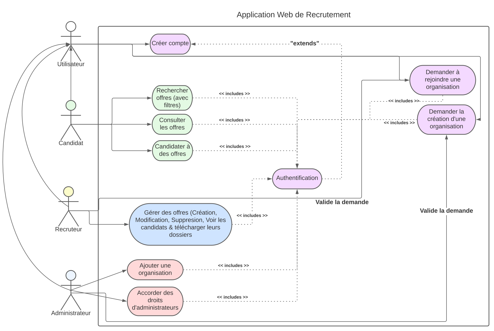
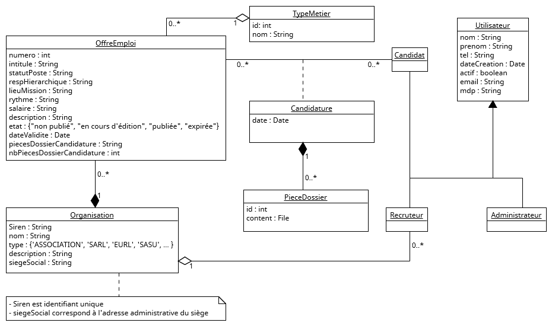
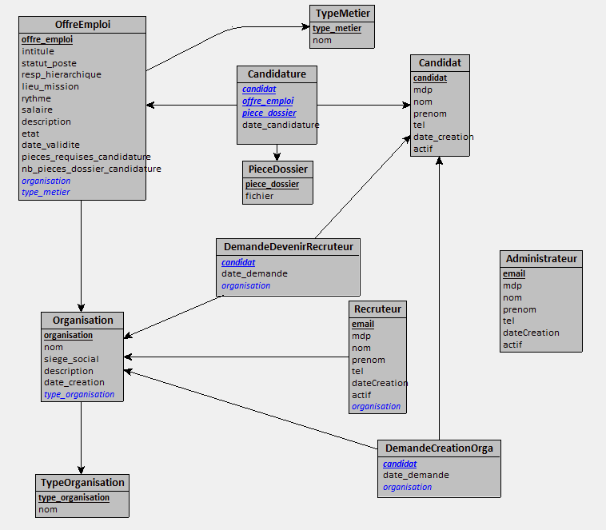

# AI16-P23

P23 - Projet AI16 : Application web de recrutement  
Membres du binôme : Eliot DEWULF et Yohan FOLLIOT


## Use Case

### Diagramme de cas d'utilisation


Lien vers le diagramme de cas d'utilisation LucidChart [ici](https://lucid.app/lucidchart/ffa23c81-deb0-4253-a641-4117829dddff/edit?viewport_loc=-889%2C-50%2C4847%2C2298%2C0_0&invitationId=inv_a2330c3b-7f48-4643-b885-6ce8ba29d6a0)
### Description des cas d'utilisation
| Use Case | Compte | Description |
| -------- | ------ | ----------- |
| Créer compte | User | L'utilisateur se crée un compte avec son adresse mail, son nom, son prénom, son mot de passe et son numéro de téléphone |
| Authentification | User | Si le compte a préalablement été créé, l'utilisateur se connecte via son email/mot de passe à son compte |
| Demander à rejoindre une organisation | User/Recruteur | L'utilisateur peut demander à rejoindre une organisation, l'authorisation sera accordée ou non par un quelconque recruteur de l'organisation |
| Demander la création d'une organisation | User/Administrateur | L'utilisateur peut demander la création d'une organisation qui sera approuvée ou non par un Administrateur |
| Rechercher des offres | Candidat | Permet de Rechercher et filtrer les offres d'emplois |
| Consulter les offres | Candidat | Permet de visualiser une offre d'emploi en particulier |
| Candidater à des offres | Candidat | Permet de candidater à des offres d'emplois |
| Gérer des offres | Recruteur | Permet de Créer, Modifier et Supprimer des offres, ainsi que de Voir les candidats et télécharger leur dossier |
| Ajouter une organisation | Administrateur | Permet d'ajouter une organisation |
| Accorder des droits d'administrateurs | Administrateur | Permet d'accorder des droits d'administrateurs à un compte utilisateur |


### Questions/Précisions
- Y-a t'il un recruteur principal qui lui seul pourra valider les ajouts de recruteurs ? Ou tout recruteur validé pourra en accepter d'autres ? => Tous les recruteurs peuvent accepter la demande de rejoindre l'organisation d'un utilisateur

## MCD UML




## MLD



## Installation et lancement du projet

1. Installer node.js
2. Installer npm
3. Se placer dans le dossier myapp et installer les modules npm avec la commande `npm install`
4. Lancer le projet avec la commande `npm start` dans le terminal

## Architecture

L'architecture de ce projet est en MVC (Modèle-Vue-Controlleur).  
Voici une arborescence détaillée du projet :

```
AI16-P23/
|-- conception/                 # contient les diagrammes et maquettes liées à la conception
|   |-- Diagramme de classes/   # diagrammes de classes du projet
|   |-- maquettes/              # storyboards, carte du site et maquettes des écrans
|   |-- MLD/                    # les différentes versions des MLD implémentées. La version définitive est le MLD.png
|   |-- Usecase.svg             # le diagramme de cas d'utilisation
|-- myapp/                      # code source du projet
|   |-- bin/www                 # fichier util au déploiement de l'application express
|   |-- models/                 # modèles du MVC. Pour faire la liaison entre les controlleurs et la base de données
|   |-- node_modules/           # modules npm utilisés
|   |-- public/                 # éléments publics nécéssaires au fonctionnement du site
|   |   |-- img                 # images nécessaires au site (logos, icones, ...)
|   |   |-- js                  # scripts js côté client
|   |   |-- stylesheets         # feuilles de style css
|   |-- requireAuth/            # Contient les middleware js qui permettent de vérifier sur chaque route que l'utilisateur dispose des doits requis.
|   |-- routes/                 # Représente les controlleurs du MVC. On y retrouve toutes les routes (url) utilisées
|   |-- views/                  # Représente la Vue du modèle MVC
|   |   |-- pages/              # pages principales ejs
|   |   |-- partials/           # éléments partiels des pages ejs  
|   |-- app.js                  # fichier pilier de l'application
|   |-- package.json            # fichier de configuration de l'application                 
|-- sql/                        # Scripts de création des tables et d'insertion dans les tables
|-- TD 1 SR10.pdf               # Sujet du Projet
|-- .gitignore                  # Fichiers à ignorer lors des commmits et "git add"
|-- README.md                   # Description générale du projet
```

## Rapport de sécurité


| Type de vulnérabilité               | Définition                                                                                                                                                                                                                                                                                                                       | Faiblesses de l'appli                                                                                                                                                                                                                                                                                                       | Méthode de protection                                                                                                                                                                                                                                     |
|-------------------------------------|----------------------------------------------------------------------------------------------------------------------------------------------------------------------------------------------------------------------------------------------------------------------------------------------------------------------------------|-----------------------------------------------------------------------------------------------------------------------------------------------------------------------------------------------------------------------------------------------------------------------------------------------------------------------------|-----------------------------------------------------------------------------------------------------------------------------------------------------------------------------------------------------------------------------------------------------------| 
| **Injection de sql**                | L'injection SQL est une technique de piratage informatique qui consiste à insérer du code SQL malveillant dans une requête afin d'exploiter une faille de sécurité et d'accéder, modifier ou supprimer des données dans une base de données.                                                                                     | L'application contient de nombreux formulaires (création de compte, création d'une organisation, ...) qui permettent à l'utilisateur d'enregistrer des informations de manière pérenne en les stockant dans la base de données. En envoyant une script sql malveillant, l'utilisateur pourrait modifier la base de données. | Stratégie préventive (mise en place dès le début) avec l'utilisatation des Prepared Statement dans les modèles.<br>Par exemple dans _offreModel.js_                                                                                                       |
| **Violation de contrôle d'accès**   | Manque de contrôle d’accès au niveau fonctionnel : les applications doivent vérifier les droits d'accès au niveau fonctionnel sur le serveur lors de l'accès à chaque fonction. Si les demandes ne sont pas vérifiées, les attaquants seront en mesure de forger des demandes afin d'accéder à une fonctionnalité non autorisée. | L'application expose de nombreuses fonctionnalités à travers des routes qui sont propres au rôle de chaque utilisateur (candidat/recruteur/admin). Il ne faudrait pas qu'un utilisateur puisse accèder à des fonctionnalités auxquelles il ne devrait pas avoir le droit.                                                   | Stratégie préventive, ajouter grâce au middleware RequireAuth une vérification du rôle de l'utilisateur sur chaque route. Par exemple, la route _/organisations/valider-nouveau-recruteur_ requiert un utilisateur authentifié avec le rôle de recruteur. |
| **Exposition de données sensibles** | Lorsque les données sensibles ne sont pas chiffrées et stockées en clair dans la base de données                                                                                                                                                                                                                                 | L'application sauvegarde de nombreuses données dans la Base de données, dont certaines très sensibles (mot de passe des utilisateurs). Si jamais grâce à une faille de sécurité un pirate venait à récupérer le contenu de la base de données, il ne faudrait pas qu'il puisse avoir accès à toutes les données sensibles.  | Stratégie corrective, ajout d'un système de chiffrement des mots de passes avant écriture et lecture dans la base de données.                                                                                                                             | 

## Fonctionnalité REST

Nous avons choisi d'implémenter le Web Service REST pour afficher les organisations qu'un candidat peut rejoindre depuis la route _/rejoindre-organisation_.  
Pour cela, nous utilisons les requêtes fetch réalisées en js côté client pour effectuer un POST qui va aller récupérer la liste des organisations en json à l'adresse _`/organisations/api-orgas-crees`_.  
Cette route prend en paramètre dans le body le type d'organisation que l'on souhaite récupérer.  
Exemple format du body : 
+ `{ "typeOrga": 0 }` pour toutes les organisations
+ `{ "typeOrga": 1 }` pour les entreprises
+ `{ "typeOrga": 2 }` pour les associations  

Exemple de contenu retourné par le POST avec un body `{ "typeOrga": 0 }` :
```json
[
    {
        "siren": "1234",
        "nom": "Carrefour",
        "id_type_organisation": 1
    },
    {
        "siren": "5678",
        "nom": "Amazon",
        "id_type_organisation": 1
    }
]
```

**Note :** Pour cette route, la vérification des droits utilisateurs est désactivée pour permettre de tester la requête facilement depuis postman.

