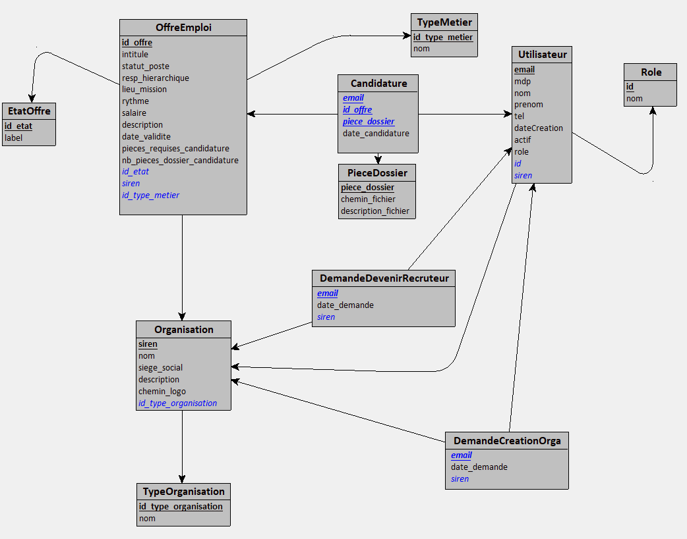

# AI16-P23
P23 - Projet AI16 

## Use Case

### Diagramme de cas d'utilisation

### Description des cas d'utilisation
| Use Case | Compte | Description |
| -------- | ------ | ----------- |
| Créer compte | User | L'utilisateur se crée un compte avec son adresse mail, son nom, son prénom, son mot de passe et son numéro de téléphone |
| Authentification | User | Si le compte a préalablement été créé, l'utilisateur se connecte via son email/mot de passe à son compte |
| Demander à rejoindre une organisation | User/Recruteur | L'utilisateur peut demander à rejoindre une organisation, l'authorisation sera accordée ou non par un quelconque recruteur de l'organisation |
| Demander la création d'une organisation | User/Administrateur | L'utilisateur peut demander la création d'une organisation qui sera approuvée ou non par un Administrateur |
| Rechercher des offres | Candidat | Permet de Rechercher et filtrer les offres d'emplois |
| Consulter les offres | Candidat | Permet de visualiser une offre d'emploi en particulier |
| Candidater à des offres | Candidat | Permet de candidater à des offres d'emplois |
| Gérer des offres | Recruteur | Permet de Créer, Modifier et Supprimer des offres, ainsi que de Voir les candidats et télécharger leur dossier |
| Ajouter une organisation | Administrateur | Permet d'ajouter une organisation |
| Accorder des droits d'administrateurs | Administrateur | Permet d'accorder des droits d'administrateurs à un compte utilisateur |

### Questions/Précisions
- Y-a t'il un recruteur principal qui lui seul pourra valider les ajouts de recruteurs ? Ou tout recruteur validé pourra en accepter d'autres ? => Tous les recruteurs peuvent accepter la demande de rejoindre l'organisation d'un utilisateur

## MCD UML

## MLD
